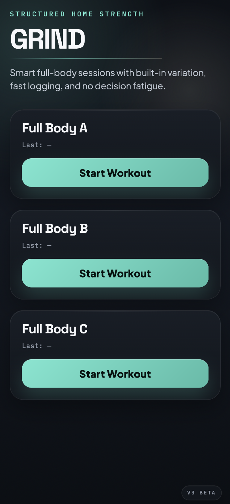
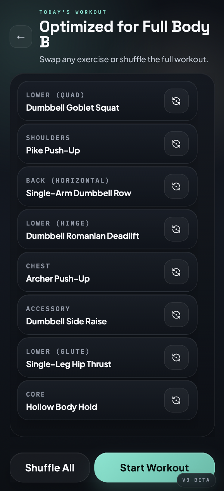
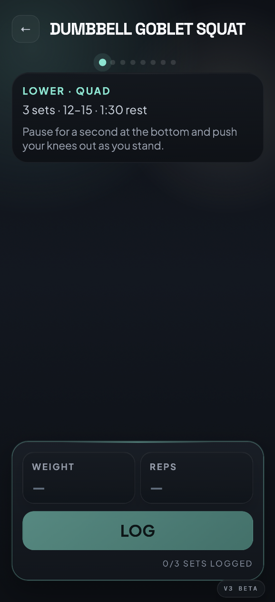
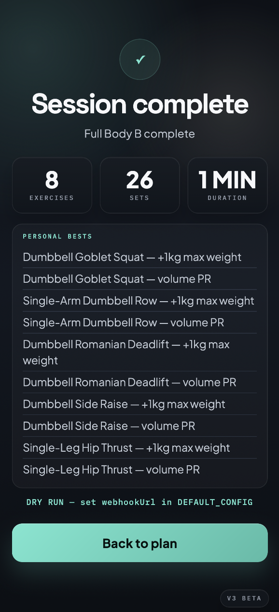

# Grind — Structured Strength

> **Built by [Tomer Liran](https://github.com/tomerlir)** — CTO & Co-Founder at [Bridge](https://usebridge.ai).

Minimalist fitness PWA for structured hypertrophy training. A/B/C full-body split with controlled exercise variation, session persistence, PR tracking, and a session-builder reveal flow. Built to solve: "I want to lift heavy things without thinking about what to do next."

**Live:** [grind.ioneon.io](https://grind.ioneon.io)

## Screenshots

| Day picker | Workout generator | Exercise log | Done |
|---|---|---|---|
|  |  |  |  |

## Tech Stack

- Vanilla JavaScript with Vite as the dev server and bundler
- HTML + custom CSS in `src/styles/app.css`
- `localStorage` for week state, active sessions, history, PRs, and sync queue
- `vite-plugin-pwa` for installability and offline support

## Running Locally

```bash
npm install
npm run dev      # start dev server
npm run build    # production build
npm run preview  # preview production build
```

## Project Structure

```text
grind/
  index.html
  src/
    main.js          # browser entrypoint, app boot, service worker, test harness
    app/
      runtime.js     # session flow, onboarding, spin logic, exercise logging
    data/
      workouts.js    # workout templates and exercise pools
    lib/
      storage.js     # guarded localStorage helpers
    config.js        # app-level runtime configuration
  assets/
  docs/
  vite.config.mjs
```

## Architectural Notes

- Framework-free — vanilla JS, modularized intentionally
- UI is CSS-first, no component library
- Storage keys and session/history behavior preserved for backward compatibility
- See `docs/ARCHITECTURE.md` for detailed schema and screen flow

## License

MIT — see [LICENSE](LICENSE)
